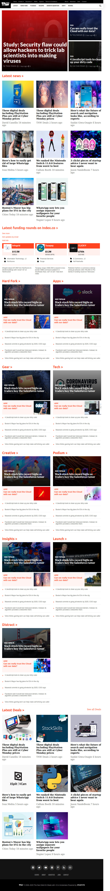
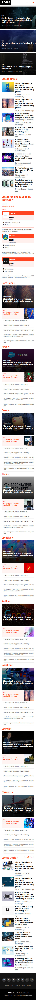

# Project 2: Building with Responsive Design

### Desktop version

### Tablet version

### Mobie version

Additional description about the project and its features.

## Built With

- HTML5
- CSS3#

## Live Demo

[Live Demo Link](https://oxenprogrammer.github.io/thenextweb-clone/)

## Getting Started

To get a local copy up and running follow these simple example steps.

### Setup
Checkout the project on your web browser with the provided link.

### Install
No installation required, simply right click on the index.html file and run it on your favorite browser.

### Deployment
Deploy on gh pages for testing purposes

## Authors

👤 **Emmanuel Okello**

- GitHub: [@githubhandle](https://github.com/oxenprogrammer)
- Twitter: [@twitterhandle](https://twitter.com/ox_emmy)
- LinkedIn: [LinkedIn](https://www.linkedin.com/in/emanuel-okello-1217b4b3/)

👤 **Alicia Rojas**

- GitHub: [@githubhandle](https://github.com/aliciapaz)
- Twitter: [@twitterhandle](https://twitter.com/aliciap38180090 )
- LinkedIn: [LinkedIn](https://www.linkedin.com/in/alicia-rojas-71468418a/ )

## 🤝 Contributing

Contributions, issues, and feature requests are welcome!

## Show your support

Give a ⭐️ if you like this project!

## Acknowledgments

- https://www.theodinproject.com/
- https://www.thenextweb.com

## 📝 License

This project is [MIT](./LICENSE) licensed.